| FA               | 60                                                                                                                                                    | 70                                                                                                                                                    | 80                                                                                                                                                            | 90                                                                                                                                                           | 100                                                                                                                                                             | 110                                                                                                                                                                 | 120                                                                                                                                                                       | 130                                                                                                                                                             | 140                                                                                                                                                               | 150                                                                                                                                                         |
| :--------------- | :---------------------------------------------------------------------------------------------------------------------------------------------------- | :---------------------------------------------------------------------------------------------------------------------------------------------------- | :------------------------------------------------------------------------------------------------------------------------------------------------------------ | :----------------------------------------------------------------------------------------------------------------------------------------------------------- | :-------------------------------------------------------------------------------------------------------------------------------------------------------------- | :------------------------------------------------------------------------------------------------------------------------------------------------------------------ | :------------------------------------------------------------------------------------------------------------------------------------------------------------------------ | :-------------------------------------------------------------------------------------------------------------------------------------------------------------- | :---------------------------------------------------------------------------------------------------------------------------------------------------------------- | :---------------------------------------------------------------------------------------------------------------------------------------------------------- |
| c14c9            |      |  | [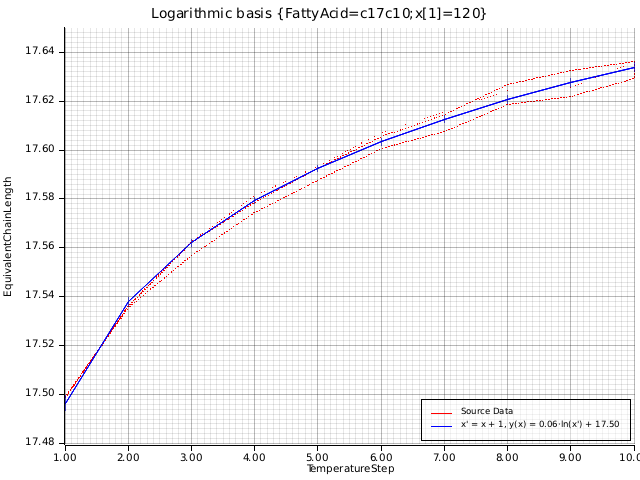](png/{FattyAcid=c17c10;x[1]=120}.png "{0=14.596388080241342;1=0.05491225451041792;R^2=0.9964017153413126}")         | [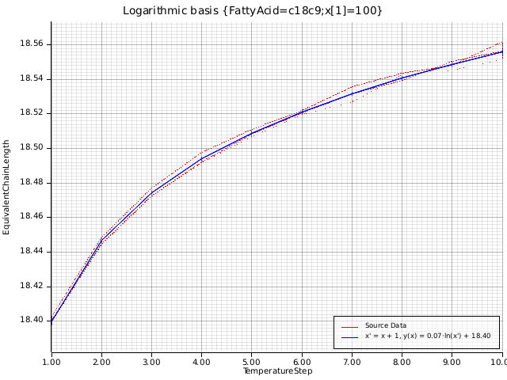](png/{FattyAcid=c18c9;x[1]=100}.png "{0=14.6000917618817;1=0.054496931837731744;R^2=0.9970685872778201}")           | [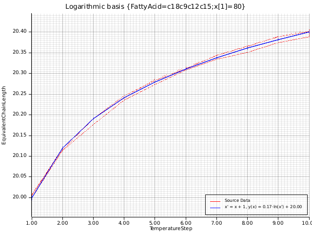](png/{FattyAcid=c18c9c12c15;x[1]=80}.png "{0=14.606898580850704;1=0.05305533837594911;R^2=0.9964099694256592}")   |              | [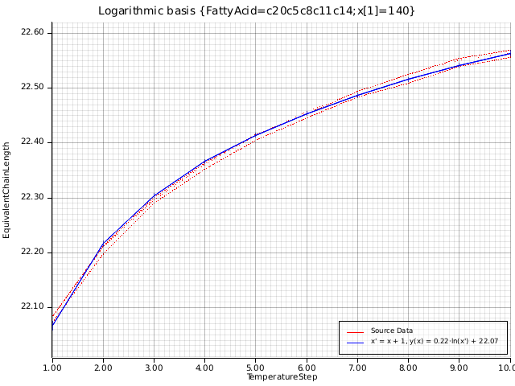](png/{FattyAcid=c20c5c8c11c14;x[1]=140}.png "{0=14.625863632473253;1=0.05112581039376440;R^2=0.993836123745612}")        |   |        | [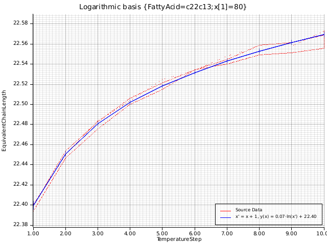](png/{FattyAcid=c22c13;x[1]=80}.png "{0=14.687055984700365;1=0.04415717720585555;R^2=0.9638290349011808}")         |
| c15c10           |      | [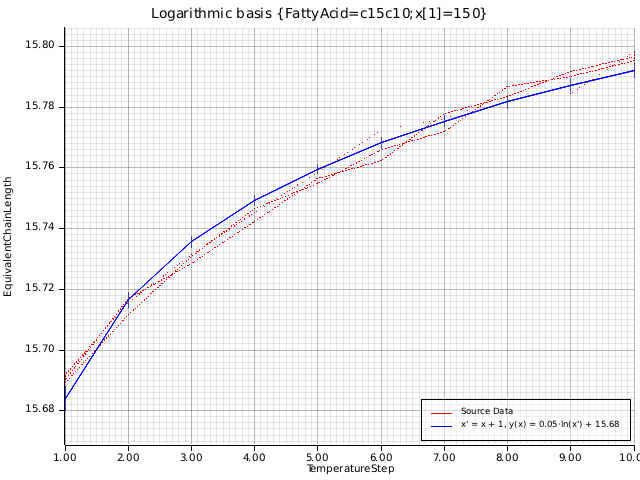](png/{FattyAcid=c15c10;x[1]=150}.png "{0=15.599913408390947;1=0.0572905931005776;R^2=0.9907618235506941}")  |           |           |     |              | [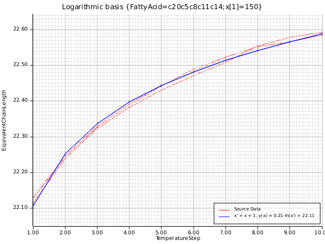](png/{FattyAcid=c20c5c8c11c14;x[1]=150}.png "{0=15.628605526506352;1=0.05294558541181882;R^2=0.9953563047868023}")       | [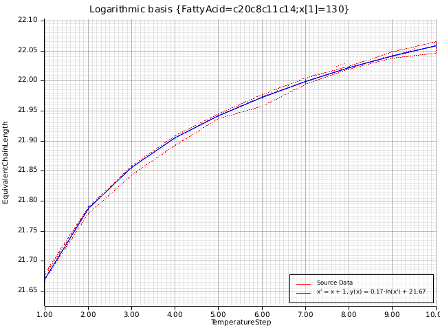](png/{FattyAcid=c20c8c11c14;x[1]=130}.png "{0=15.6427284415787;1=0.05115107826886511;R^2=0.9955699816954231}")   |        |             |
| c16c9            | [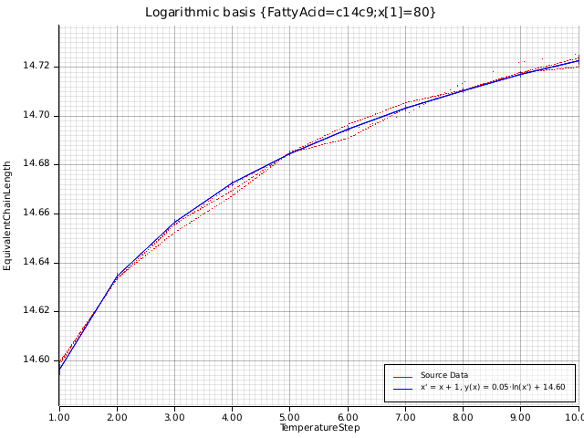](png/{FattyAcid=c14c9;x[1]=80}.png "{0=16.469123006508337;1=0.06292473493214334;R^2=0.9970466410171414}")     |       |          |           | [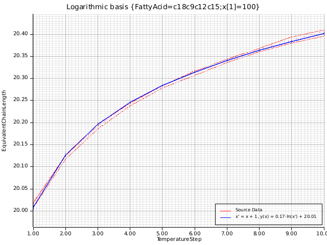](png/{FattyAcid=c18c9c12c15;x[1]=100}.png "{0=16.481049472604038;1=0.05985351547260187;R^2=0.9969575072723083}") |              |    | [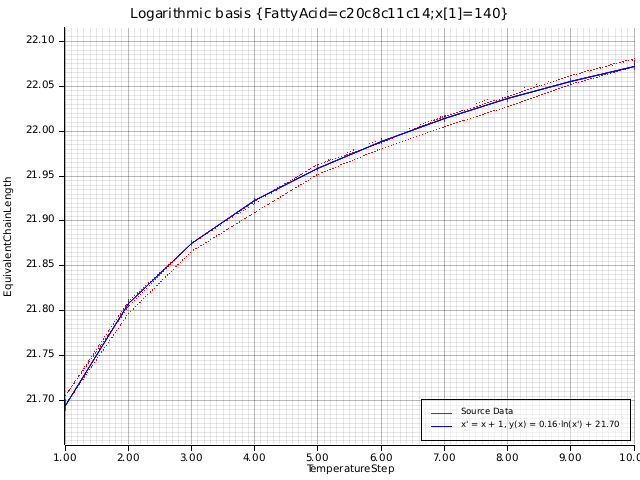](png/{FattyAcid=c20c8c11c14;x[1]=140}.png "{0=16.508840068768755;1=0.05641251938399971;R^2=0.9941128325243547}") | [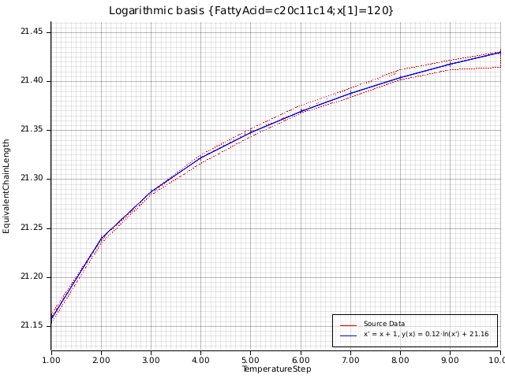](png/{FattyAcid=c20c11c14;x[1]=120}.png "{0=16.526652318920036;1=0.05367330880540599;R^2=0.9921532761037328}")       |        |
| c17c10           |         | [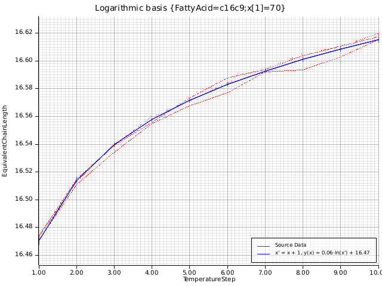](png/{FattyAcid=c16c9;x[1]=70}.png "{0=17.474410416949233;1=0.06348053299468681;R^2=0.9924708134032408}")     | [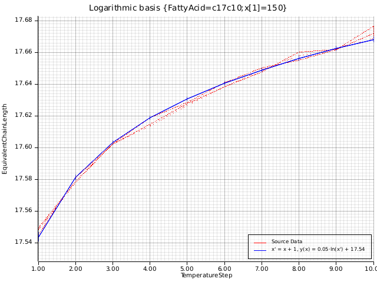](png/{FattyAcid=c17c10;x[1]=150}.png "{0=17.47535353572047;1=0.06284696112846433;R^2=0.9954774198690595}")          | [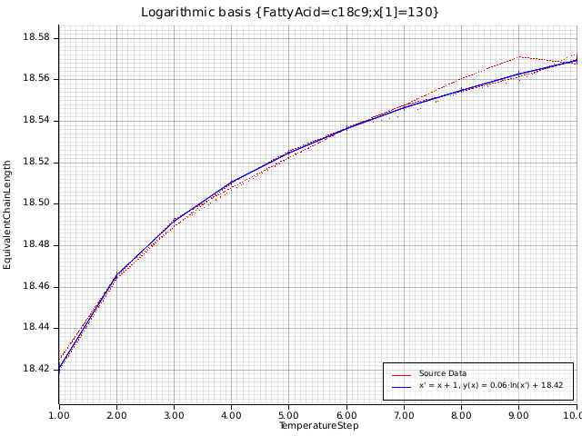](png/{FattyAcid=c18c9;x[1]=130}.png "{0=17.47763531536347;1=0.06301257570067254;R^2=0.9952844915154109}")           |  |                |    | [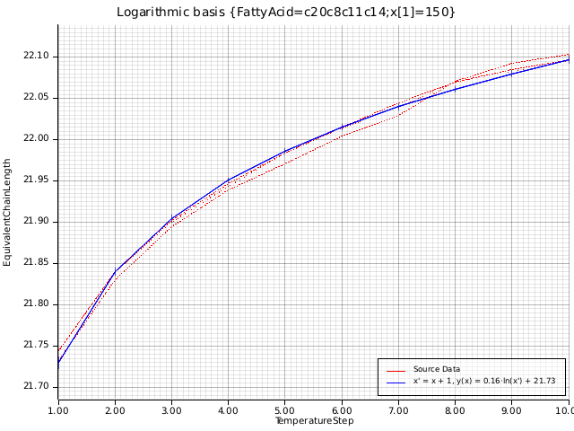](png/{FattyAcid=c20c8c11c14;x[1]=150}.png "{0=17.50732147796796;1=0.05896310794824444;R^2=0.9962428865704553}")  | [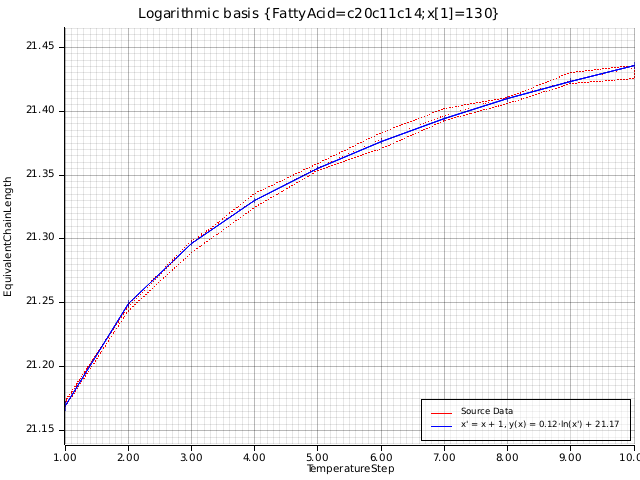](png/{FattyAcid=c20c11c14;x[1]=130}.png "{0=17.524116756599668;1=0.05575651915819701;R^2=0.9954411755928397}")       |        |
| c18c6c9c12       | [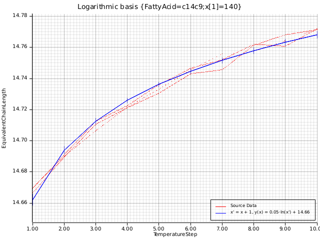](png/{FattyAcid=c14c9;x[1]=140}.png "{0=19.62779083131455;1=0.1627540065707116;R^2=0.995652532356655}")      |     | [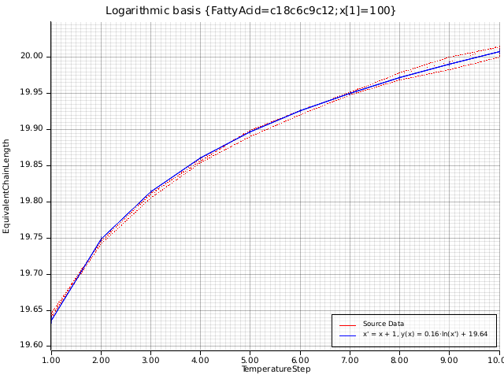](png/{FattyAcid=c18c6c9c12;x[1]=100}.png "{0=19.627644501393192;1=0.16379860342156682;R^2=0.9981829087559341}") | [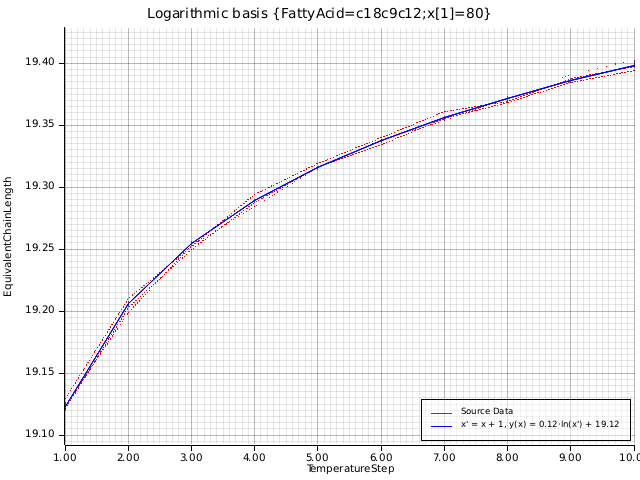](png/{FattyAcid=c18c9c12;x[1]=80}.png "{0=19.63086729746012;1=0.16302411288897645;R^2=0.9975524979960222}")       |                | [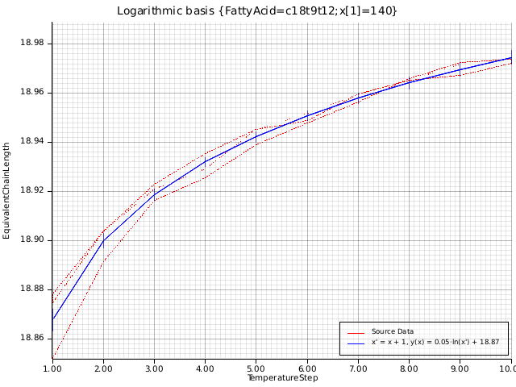](png/{FattyAcid=c18t9t12;x[1]=140}.png "{0=19.64601480096934;1=0.15850081978550357;R^2=0.9966641194653129}")            | [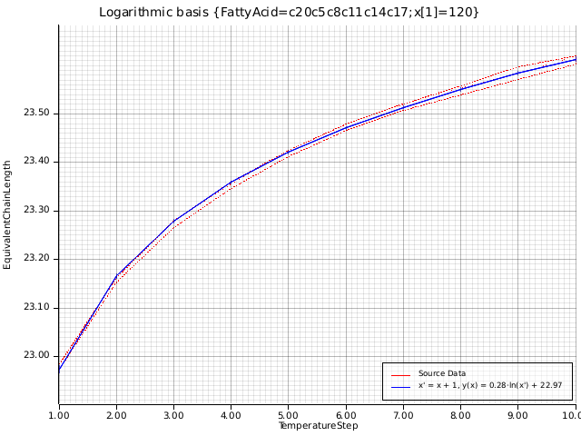](png/{FattyAcid=c20c5c8c11c14c17;x[1]=120}.png "{0=19.662158987668434;1=0.15533540727227546;R^2=0.9969975929829766}") |             |    | [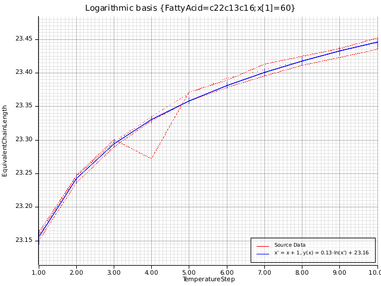](png/{FattyAcid=c22c13c16;x[1]=60}.png "{0=19.755727499446706;1=0.14256326624423465;R^2=0.9933829264135537}")   |
| c18c9            |    |        | [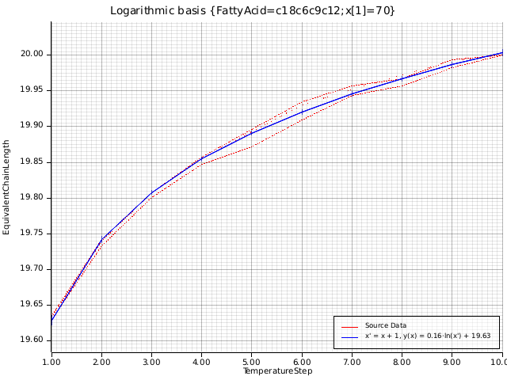](png/{FattyAcid=c18c6c9c12;x[1]=70}.png "{0=18.3950289902646;1=0.06907289938273209;R^2=0.996512640884142}")      |           | [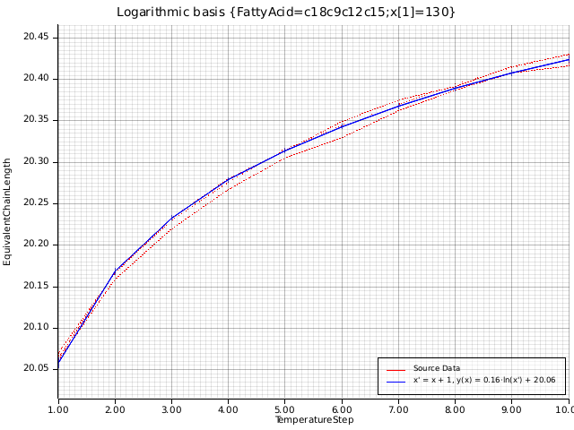](png/{FattyAcid=c18c9c12c15;x[1]=130}.png "{0=18.400221805934336;1=0.06756357793232848;R^2=0.997131205167403}")  |             | [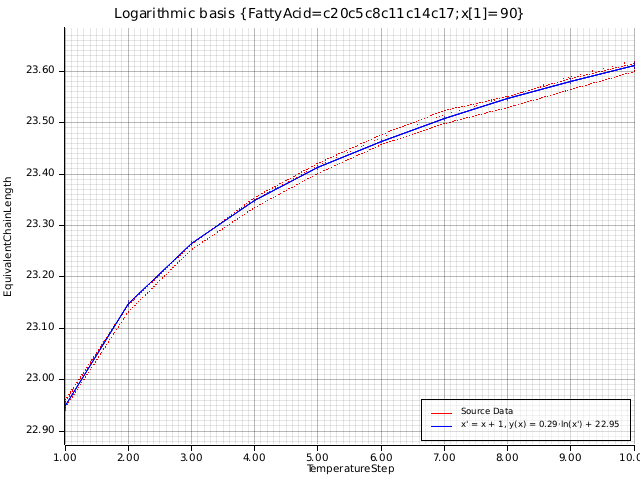](png/{FattyAcid=c20c5c8c11c14c17;x[1]=90}.png "{0=18.411348579774796;1=0.06644846381678349;R^2=0.9966341753509543}")   | [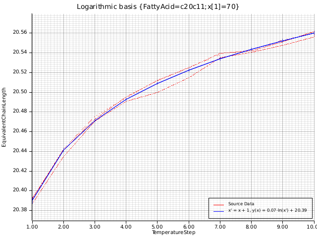](png/{FattyAcid=c20c11;x[1]=70}.png "{0=18.421102376622184;1=0.06445269423880351;R^2=0.9963501903507085}")             |        | [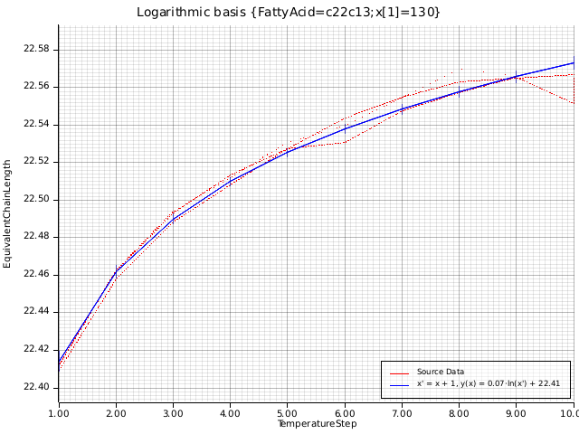](png/{FattyAcid=c22c13;x[1]=130}.png "{0=18.449305282429666;1=0.06068839032980566;R^2=0.985160167784347}")        |
| c18c9c12         |    | [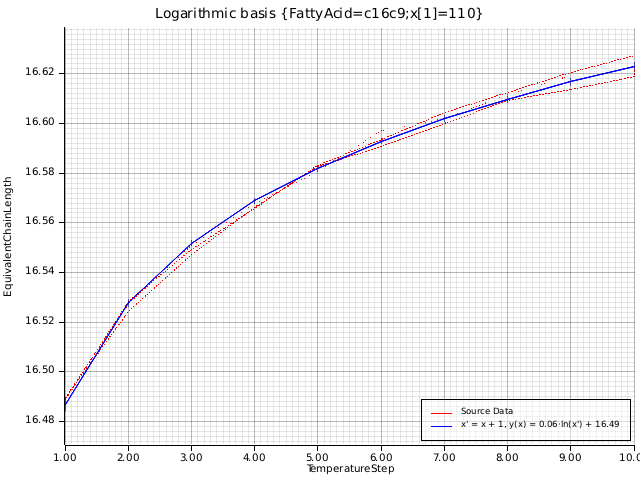](png/{FattyAcid=c16c9;x[1]=110}.png "{0=19.121819195454453;1=0.12016661427539077;R^2=0.9982415860456979}")   | [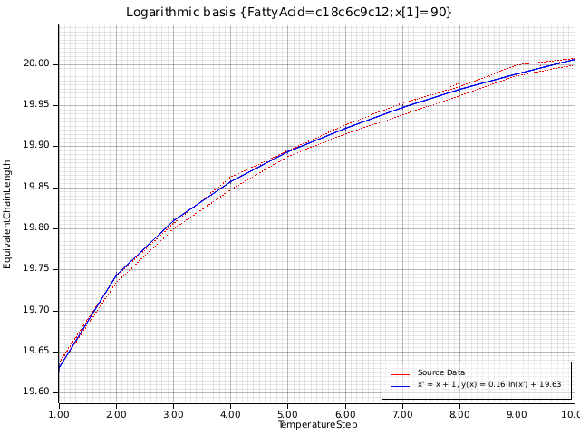](png/{FattyAcid=c18c6c9c12;x[1]=90}.png "{0=19.122967488655004;1=0.11967084832569874;R^2=0.9983676674345763}")   | [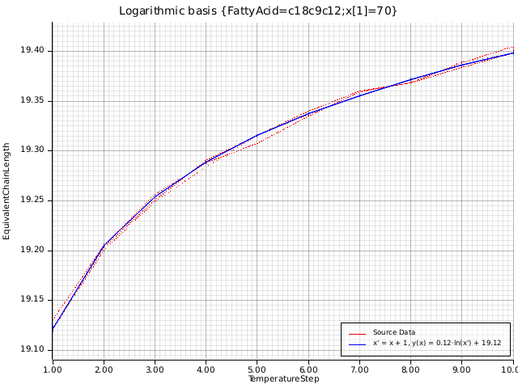](png/{FattyAcid=c18c9c12;x[1]=70}.png "{0=19.126666131347584;1=0.11768849318110242;R^2=0.9990641821033441}")      |  | [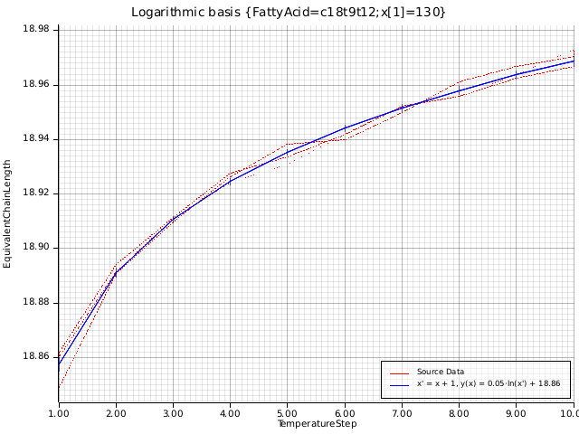](png/{FattyAcid=c18t9t12;x[1]=130}.png "{0=19.136974426551077;1=0.11591034770787267;R^2=0.9978126816141124}")           | [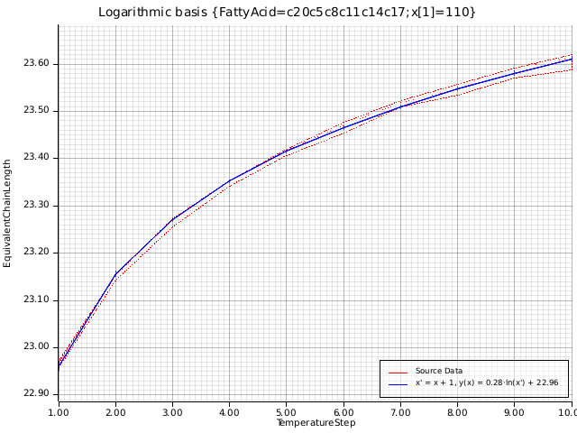](png/{FattyAcid=c20c5c8c11c14c17;x[1]=110}.png "{0=19.148991088785017;1=0.1137851337303708;R^2=0.9986251019171279}")  | [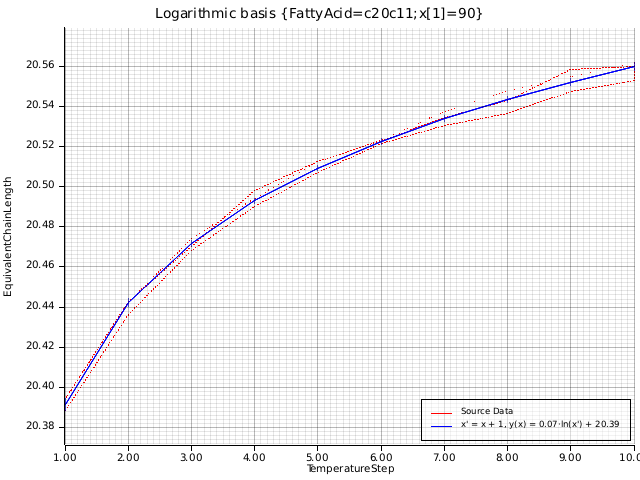](png/{FattyAcid=c20c11;x[1]=90}.png "{0=19.165055106400917;1=0.11063970699988168;R^2=0.9973463952657345}")             | [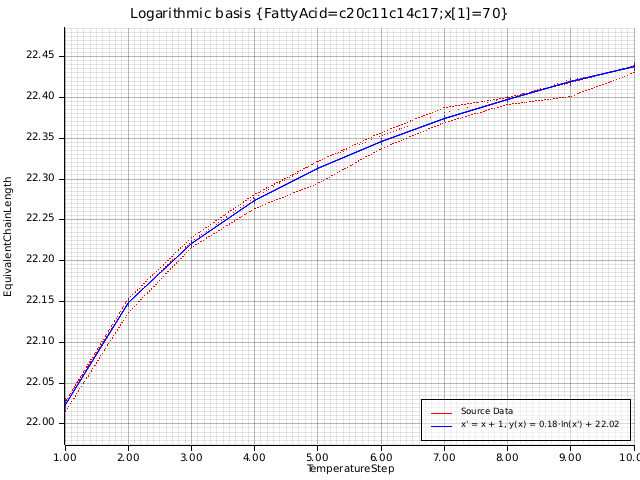](png/{FattyAcid=c20c11c14c17;x[1]=70}.png "{0=19.187154230735977;1=0.10676266652210664;R^2=0.9931271408763352}")   |         |
| c18c9c12c15      | [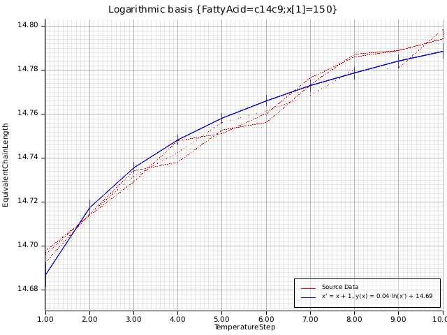](png/{FattyAcid=c14c9;x[1]=150}.png "{0=19.999533689259632;1=0.17354060532528592;R^2=0.9962460660051051}")   | [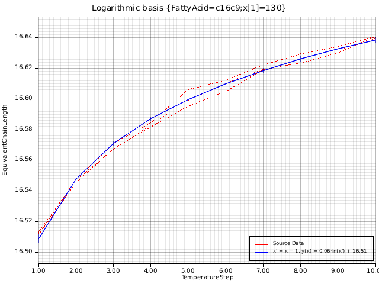](png/{FattyAcid=c16c9;x[1]=130}.png "{0=19.999421232642753;1=0.17360291794696536;R^2=0.9959917157098837}")   | [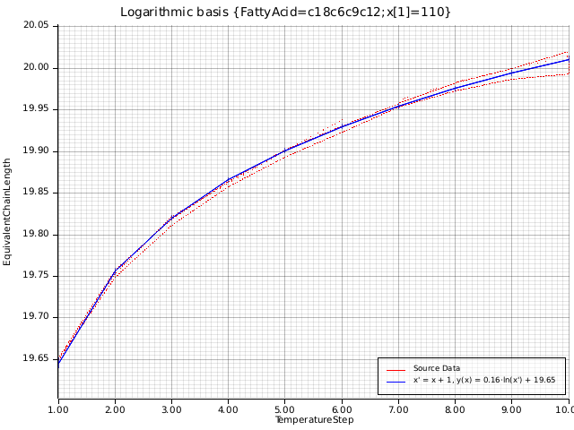](png/{FattyAcid=c18c6c9c12;x[1]=110}.png "{0=19.999743738465835;1=0.17393742647618637;R^2=0.997463566925988}")  | [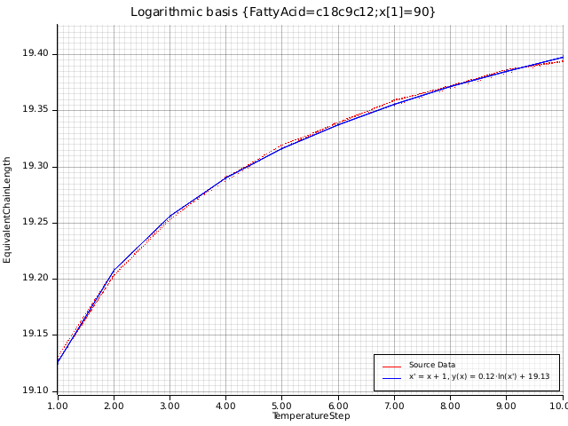](png/{FattyAcid=c18c9c12;x[1]=90}.png "{0=20.00333776772429;1=0.17214907783122158;R^2=0.9968845431198832}")       | [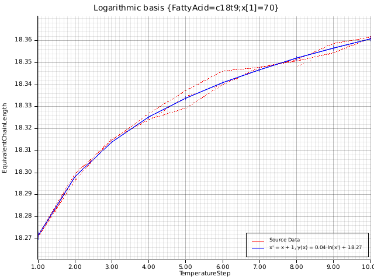](png/{FattyAcid=c18t9;x[1]=70}.png "{0=20.008480546143296;1=0.17091123794414464;R^2=0.9977665243781466}")               |             |  |             |       |    |
| c18t9            |     | [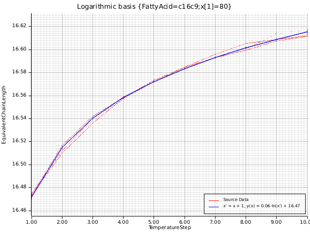](png/{FattyAcid=c16c9;x[1]=80}.png "{0=18.27148165481862;1=0.03876056139536743;R^2=0.9948558237575801}")      |    |           |    | [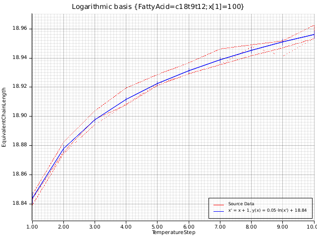](png/{FattyAcid=c18t9t12;x[1]=100}.png "{0=18.27819322109893;1=0.03778167501515117;R^2=0.9954036729989839}")            | [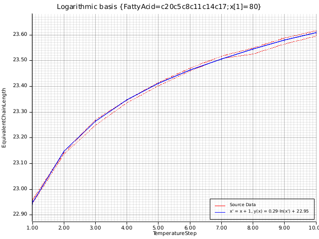](png/{FattyAcid=c20c5c8c11c14c17;x[1]=80}.png "{0=18.282377727576556;1=0.03671592420518443;R^2=0.9963181971789264}")   | [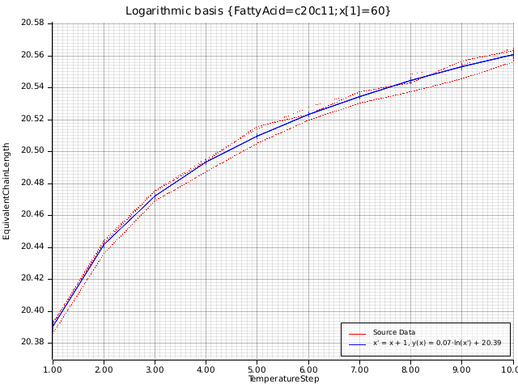](png/{FattyAcid=c20c11;x[1]=60}.png "{0=18.287343399785932;1=0.03648653302145188;R^2=0.9956443245949731}")             | [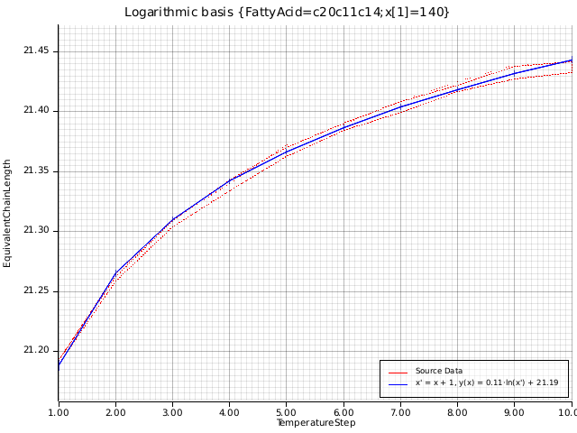](png/{FattyAcid=c20c11c14;x[1]=140}.png "{0=18.29495464818038;1=0.034853098610387434;R^2=0.9859029268825061}")       |         |
| c18t9t12         | [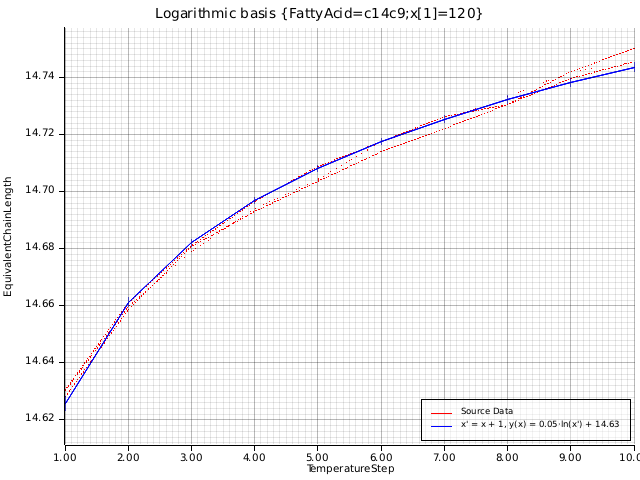](png/{FattyAcid=c14c9;x[1]=120}.png "{0=18.839265696292088;1=0.04998878328720302;R^2=0.990679327130553}")    |    |    |       | [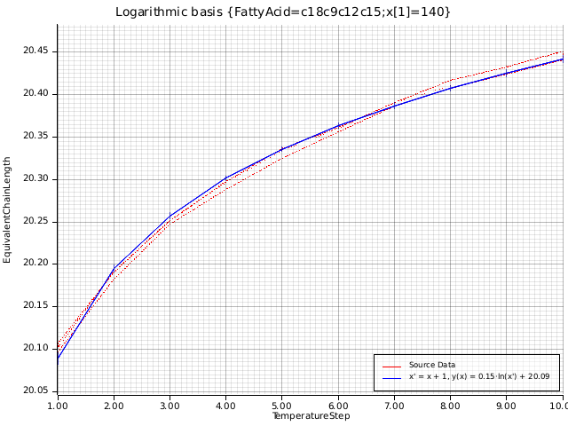](png/{FattyAcid=c18c9c12c15;x[1]=140}.png "{0=18.844258864547456;1=0.04852978427274834;R^2=0.9839210229925586}") | [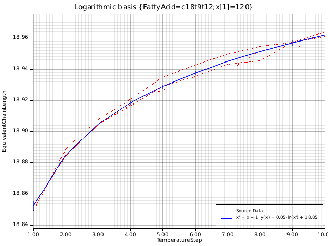](png/{FattyAcid=c18t9t12;x[1]=120}.png "{0=18.8465566476982;1=0.048139669191691326;R^2=0.9853126999020148}")            |   |              |    | [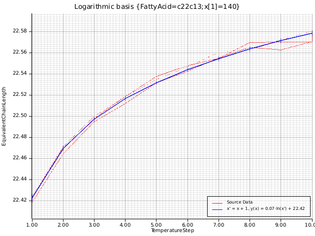](png/{FattyAcid=c22c13;x[1]=140}.png "{0=18.878390378674283;1=0.0481788571944719;R^2=0.9296813631870432}")        |
| c20c11           | [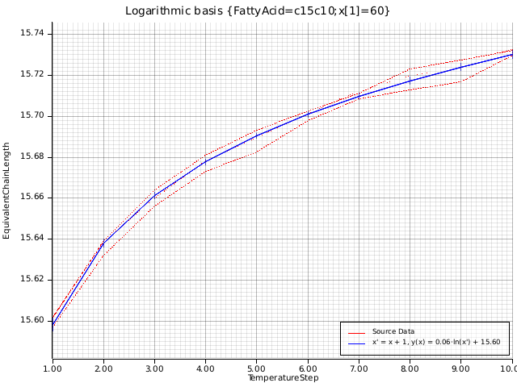](png/{FattyAcid=c15c10;x[1]=60}.png "{0=20.39087726538857;1=0.07388624737189176;R^2=0.9941097616360809}")    | [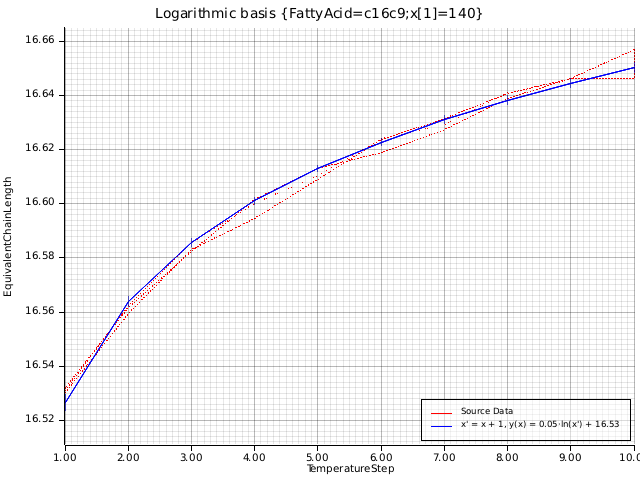](png/{FattyAcid=c16c9;x[1]=140}.png "{0=20.390377371431782;1=0.0737209541237025;R^2=0.995210579631298}")     | [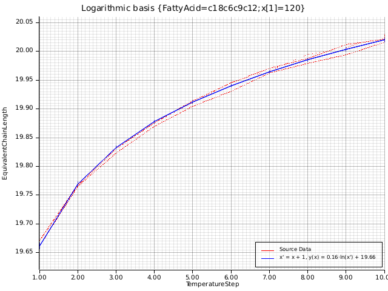](png/{FattyAcid=c18c6c9c12;x[1]=120}.png "{0=20.39010486575432;1=0.07405676560560082;R^2=0.9965135591029459}")  |      | [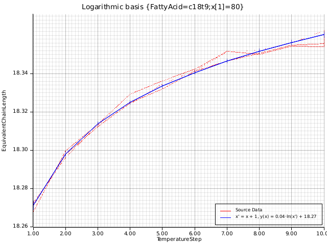](png/{FattyAcid=c18t9;x[1]=80}.png "{0=20.392383555353618;1=0.073400163796002;R^2=0.9964328245506567}")                 |     | [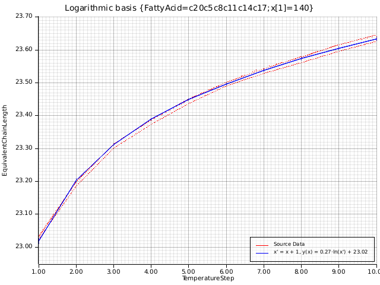](png/{FattyAcid=c20c5c8c11c14c17;x[1]=140}.png "{0=20.403879833660657;1=0.06989185496982486;R^2=0.9960138984788578}") | [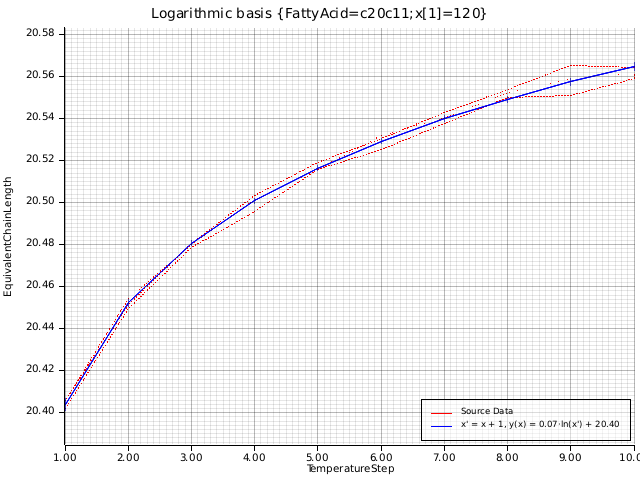](png/{FattyAcid=c20c11;x[1]=120}.png "{0=20.41199068191602;1=0.06844422135424111;R^2=0.9962198850280255}")            | [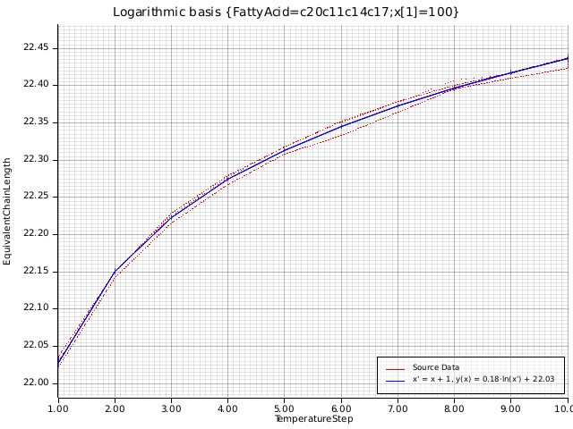](png/{FattyAcid=c20c11c14c17;x[1]=100}.png "{0=20.424120588873826;1=0.06618322709857338;R^2=0.9964982240378537}") | [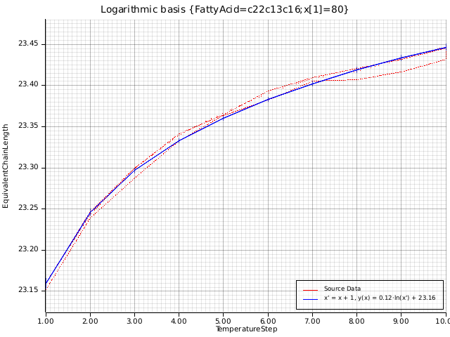](png/{FattyAcid=c22c13c16;x[1]=80}.png "{0=20.439768993234722;1=0.06352154838404545;R^2=0.9973684089744358}")   |
| c20c11c14        |     |    |   | [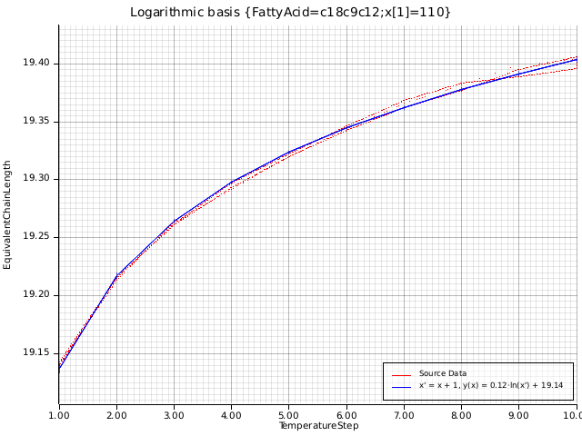](png/{FattyAcid=c18c9c12;x[1]=110}.png "{0=21.142745234034898;1=0.12244545662060524;R^2=0.9968049571713773}")    | [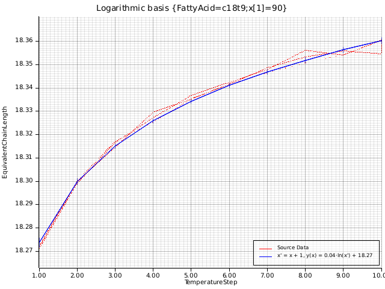](png/{FattyAcid=c18t9;x[1]=90}.png "{0=21.143738663649412;1=0.12251546868116847;R^2=0.9984287929858915}")               | [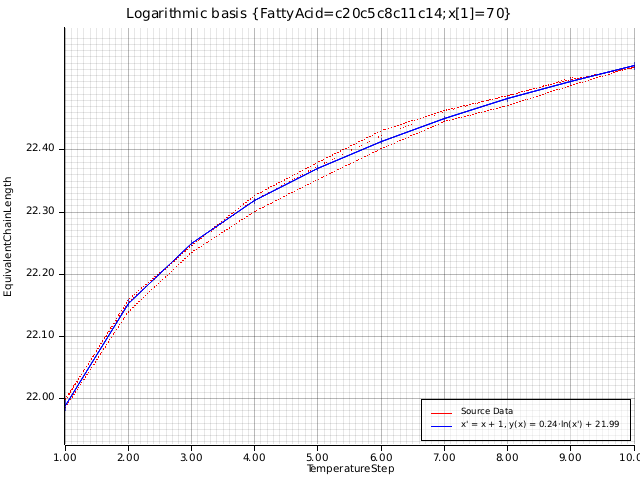](png/{FattyAcid=c20c5c8c11c14;x[1]=70}.png "{0=21.150024490389036;1=0.1202300371900975;R^2=0.9962844120801174}")    | [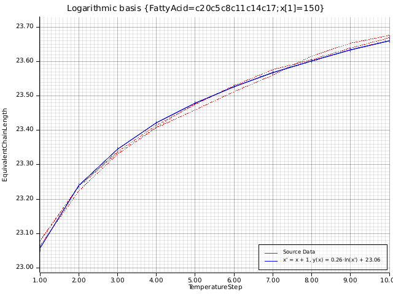](png/{FattyAcid=c20c5c8c11c14c17;x[1]=150}.png "{0=21.15765521976573;1=0.11836512448786429;R^2=0.9966063740985707}")  | [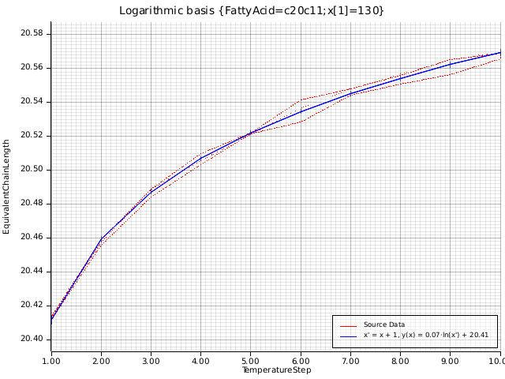](png/{FattyAcid=c20c11;x[1]=130}.png "{0=21.169599251324613;1=0.11551253183066379;R^2=0.9974296144320998}")           |   | [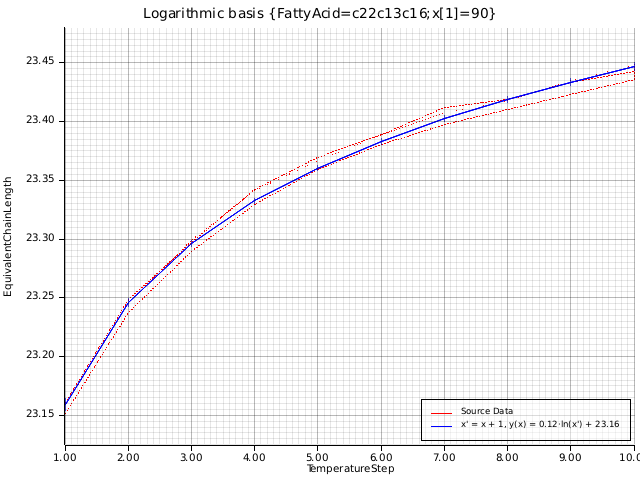](png/{FattyAcid=c22c13c16;x[1]=90}.png "{0=21.212927498204355;1=0.10848258663518351;R^2=0.9954577798619314}")   |
| c20c11c14c17     | [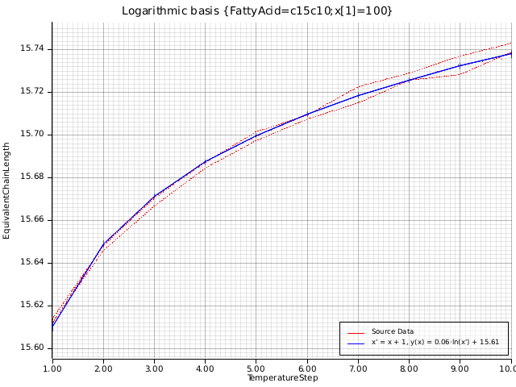](png/{FattyAcid=c15c10;x[1]=100}.png "{0=22.02393469555413;1=0.17925184830355967;R^2=0.9947342168643306}")  |    |               |      |                  |   |               |          | [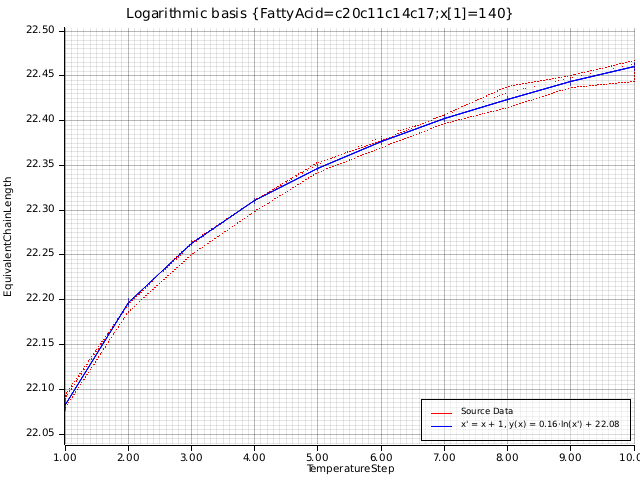](png/{FattyAcid=c20c11c14c17;x[1]=140}.png "{0=22.083028484073996;1=0.1639489078069989;R^2=0.9959530025056178}")  |    |
| c20c5c8c11c14    | [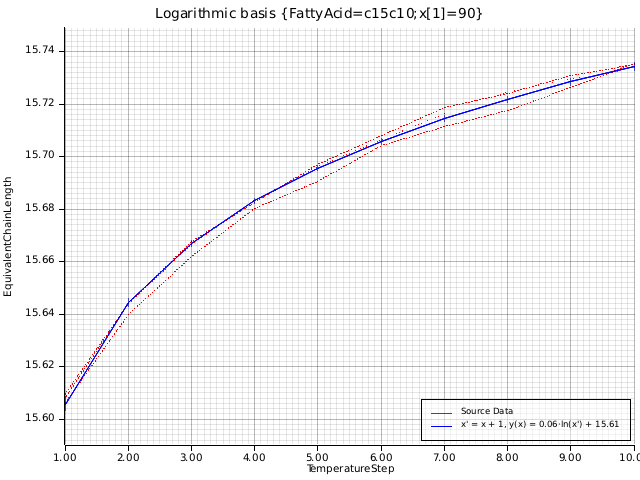](png/{FattyAcid=c15c10;x[1]=90}.png "{0=21.987644043467043;1=0.23770388907172624;R^2=0.996695448060796}")    |    |   | [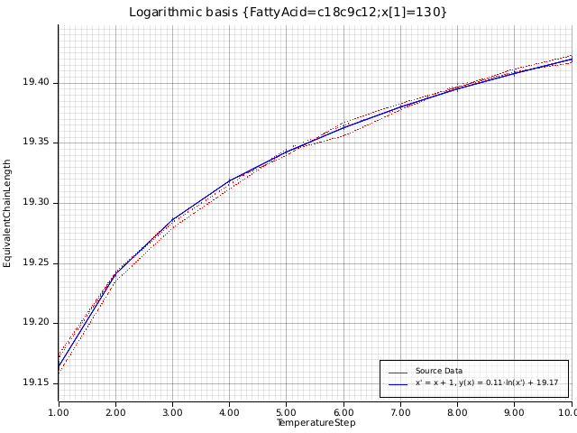](png/{FattyAcid=c18c9c12;x[1]=130}.png "{0=21.989996273297468;1=0.23655645218956955;R^2=0.9979998072924253}")    |               |    |               |             |   |  |
| c20c5c8c11c14c17 | [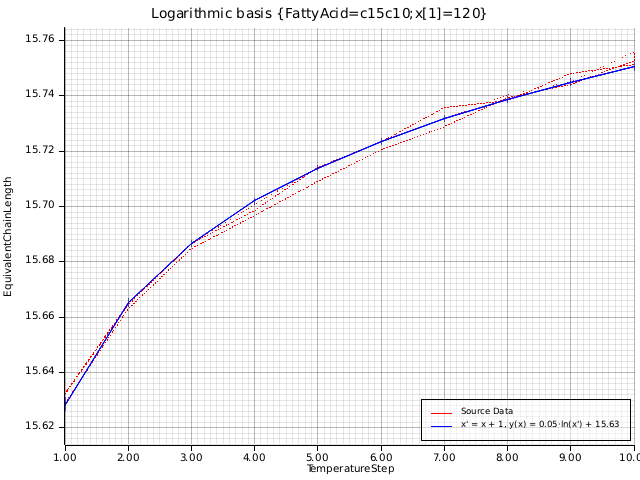](png/{FattyAcid=c15c10;x[1]=120}.png "{0=22.948724024157137;1=0.28734000788964664;R^2=0.9973721880523211}") |   |                |  |               | [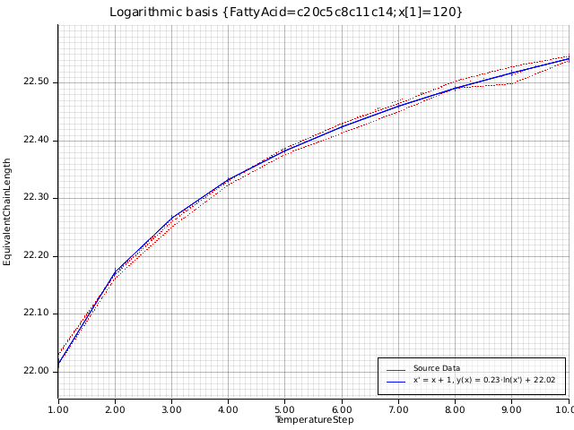](png/{FattyAcid=c20c5c8c11c14;x[1]=120}.png "{0=22.961043273232026;1=0.28207296609721233;R^2=0.9976887722952968}") |            | [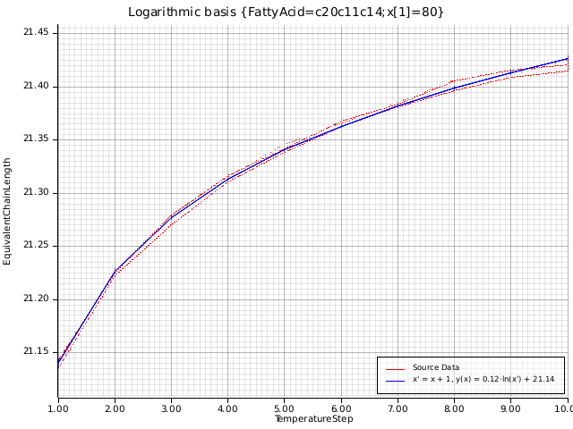](png/{FattyAcid=c20c11c14;x[1]=80}.png "{0=22.988292332900773;1=0.27663939754648226;R^2=0.9975407623422339}")       |                 |   |
| c20c8c11c14      |    |     | [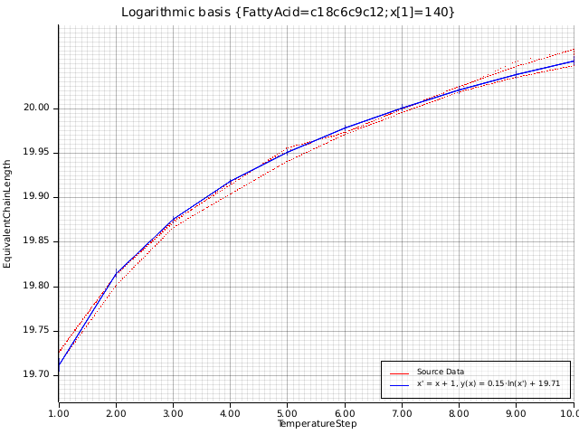](png/{FattyAcid=c18c6c9c12;x[1]=140}.png "{0=21.63514983151702;1=0.1774870532885373;R^2=0.9976297556725087}")   | [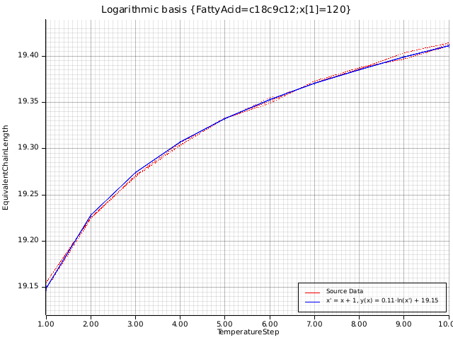](png/{FattyAcid=c18c9c12;x[1]=120}.png "{0=21.632190018962888;1=0.17896196530733732;R^2=0.9924341098701361}")    |              |     |              |             | [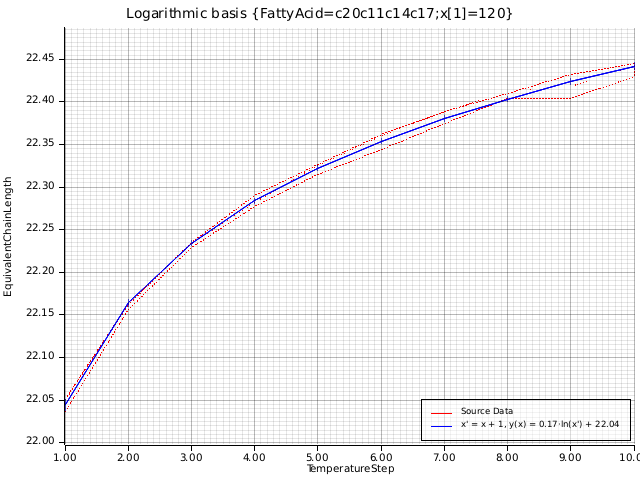](png/{FattyAcid=c20c11c14c17;x[1]=120}.png "{0=21.695002580204854;1=0.1639495850221202;R^2=0.9967381615575062}")  |  |
| c22c13           | [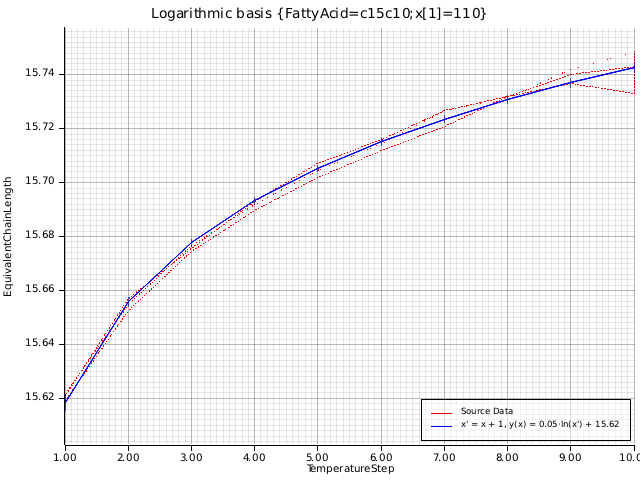](png/{FattyAcid=c15c10;x[1]=110}.png "{0=22.400877538451738;1=0.07269304013622424;R^2=0.9856030868997189}") | [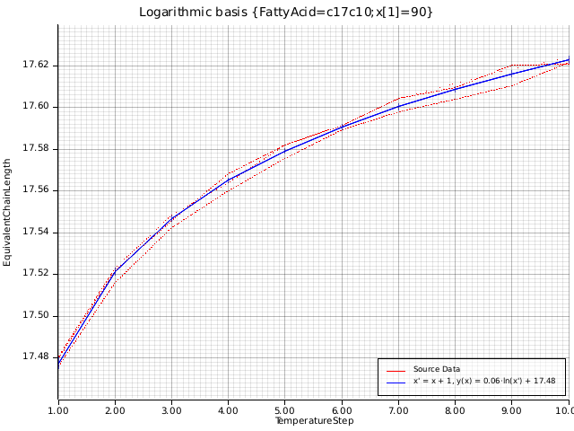](png/{FattyAcid=c17c10;x[1]=90}.png "{0=22.39986338602676;1=0.07357973160168463;R^2=0.9912994760310324}")    |              | [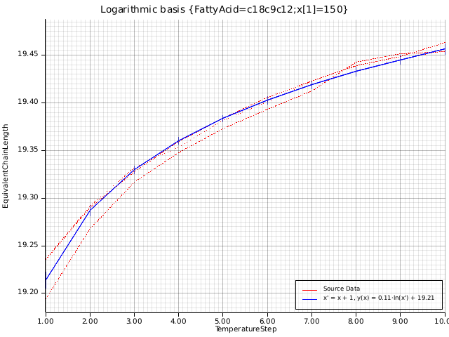](png/{FattyAcid=c18c9c12;x[1]=150}.png "{0=22.400540866347008;1=0.07275849875981244;R^2=0.9901649097053137}")    | [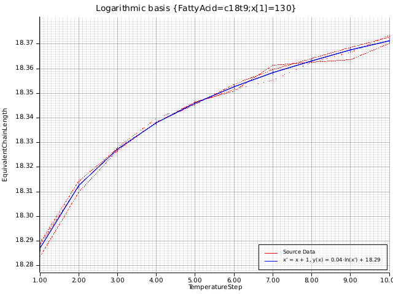](png/{FattyAcid=c18t9;x[1]=130}.png "{0=22.401217425837654;1=0.07262622046405554;R^2=0.9946783349172615}")             |  | [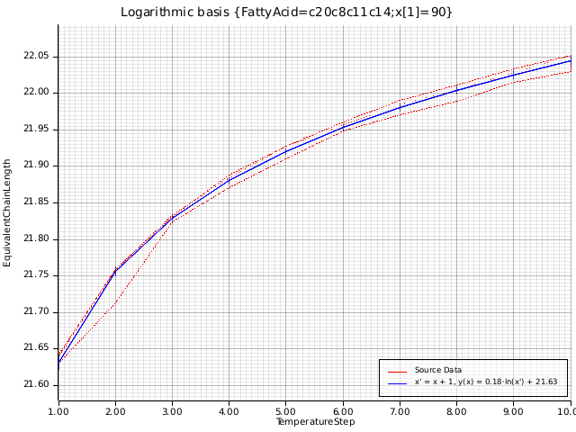](png/{FattyAcid=c20c8c11c14;x[1]=90}.png "{0=22.40807649181927;1=0.07118969259379959;R^2=0.9918037399158026}")              | [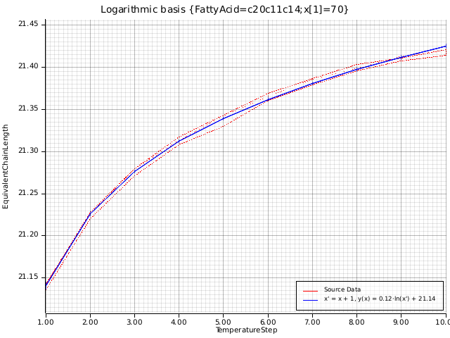](png/{FattyAcid=c20c11c14;x[1]=70}.png "{0=22.41423144171005;1=0.06902056912406174;R^2=0.9852603181927209}")        |   | [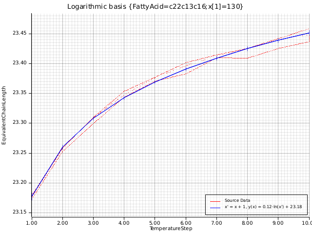](png/{FattyAcid=c22c13c16;x[1]=130}.png "{0=22.4355480163198;1=0.06595869902459306;R^2=0.995513309843169}")    |
| c22c13c16        |   | [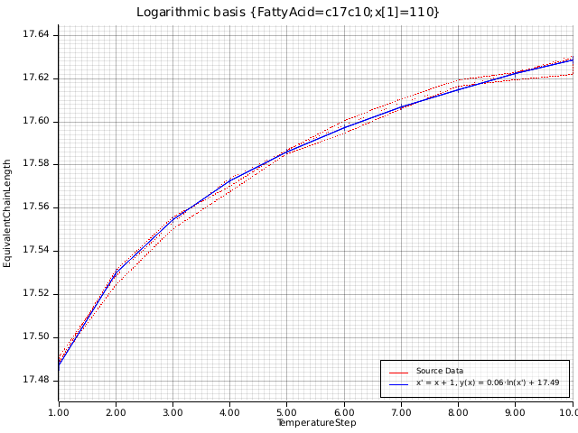](png/{FattyAcid=c17c10;x[1]=110}.png "{0=23.159564907327493;1=0.1248579907165368;R^2=0.9946924512441186}")  |               |  | [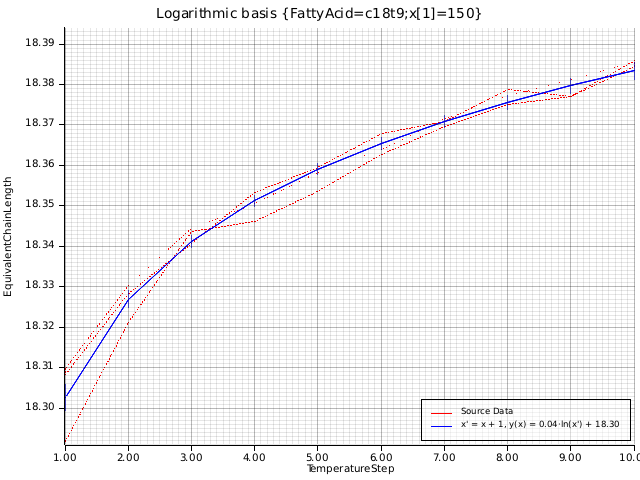](png/{FattyAcid=c18t9;x[1]=150}.png "{0=23.160714461867585;1=0.12411375063082986;R^2=0.9945566393748753}")             | [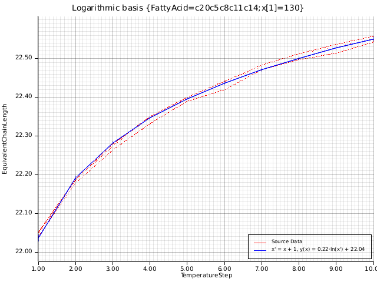](png/{FattyAcid=c20c5c8c11c14;x[1]=130}.png "{0=23.164927165649395;1=0.12188735190663458;R^2=0.9934866003420052}") | [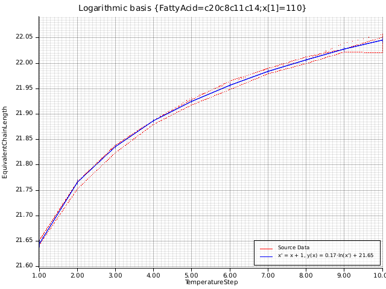](png/{FattyAcid=c20c8c11c14;x[1]=110}.png "{0=23.170566539022815;1=0.12043340032994543;R^2=0.994904031343521}")            |           |                 |    |
